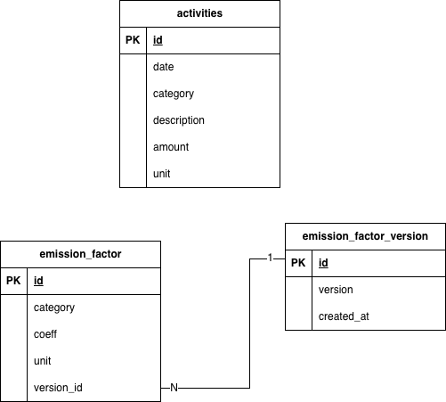
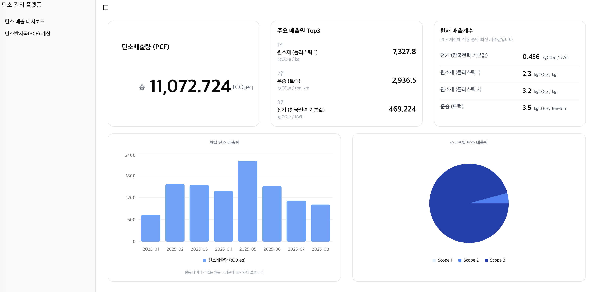
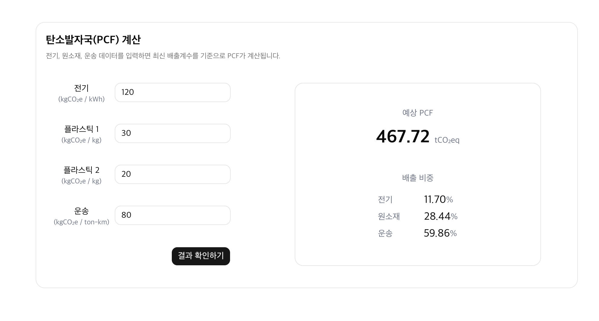
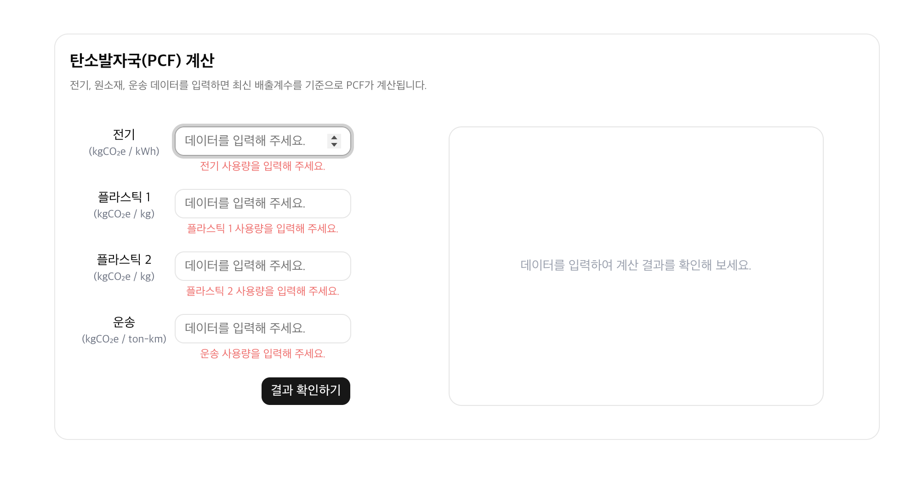

# 탄소 관리 플랫폼

## 프로젝트 소개

탄소 배출 활동 데이터를 기반으로 제품 탄소 발자국(PCF)을 분석하고 시각화하는 탄소 분석 플랫폼입니다.

---

## 주요 기능

### 총 PCF 계산

- 활동 데이터와 배출계수를 기반으로 총 탄소 배출량 계산
- 최신 배출계수를 적용하여 결과 제공

### 주요 배출원 Top3

- 배출량 기준 주요 배출원을 Top3 형태로 시각화
- 배출 비중이 높은 항목 우선 제공

### 월별 PCF 분석

- 월별 탄소 배출량 추이를 Bar Chart로 시각화
- 기간별 배출량 변화 확인 가능

### Scope별 배출 분석

- Scope 기준 탄소 배출 비율을 Pie Chart로 제공

### 현재 배출계수 조회

- 현재 적용 중인 최신 배출계수 정보 제공
- 배출계수 버전 테이블 기반 최신 데이터 조회

---

## 설계 및 구현

### Backend

- Next.js App Router 기반 API 구현
- PostgreSQL 기반 활동 데이터 및 배출계수 관리
- 배출계수 버전 테이블 분리를 통한 최신 데이터 조회 구조 설계

### Frontend

- React Query 기반 서버 상태 관리
- Tailwind CSS 및 shadcn/ui 기반 대시보드 UI 구성
- Chart 기반 데이터 시각화 구현

### Infra

- Docker Compose 환경 구성
- init.sql을 통해 초기 데이터 자동 설정

## 환경 변수 설정 (.env.local)
```bash
DATABASE_URL=postgresql://사용자명:비밀번호@호스트:포트/DB명
NEXT_PUBLIC_API_URL=http://localhost:3000/api
```

## 로컬 실행 방법
### 1. 패키지 설치
```bash
yarn install
```
### 2. 프로젝트 빌드
```bash
yarn build
```
### 3. 프로젝트 실행
```bash
yarn start
```

## Docker Compose 실행 방법

### 1. Docker Compose 실행
```bash
docker compose up --build
```
### 2. 브라우저 접속
```bash
http://localhost:3000
```
### 3. 종료
```bash
docker compose down
```

## 프로젝트 구조
```bash
hanaloop-carbon-dashboard
├── app
├── components
│   ├── dashboard
│   ├── pcfCalculator
│   └── ui
├── docker
├── hooks
│   └── dashboard
├── lib
├── types
├── docker-compose.yml
├── Dockerfile
└── README.md
```

## ERD


## AI 도구 사용 내역
- ChatGPT
  - README 구성 및 문서 정리
  - Docker Compose 실행 환경 구성 학습
  - PostgreSQL 및 쿼리 작성 문법 참고
  - UI 구성 방향 참고

## 실행 화면
### 대시보드


### PCF 계산 결과


### 입력값 에러 메시지

